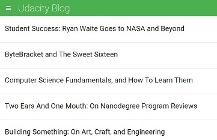

# Feed Reader Project

The purpose of this project is to code specs for the feed reader application.

### To run application

To run this application, open the index.html in your internet browser (i.e. Chrome, Firefox, Internet Explorer).  Upon opening the application, the browser will look similar to the image below.

### How to use application

The application loads the "Udacity Blog" by default.  To change the source of the feed, click the hamburger icon on the upper left.  A menu will appear showing different source feeds.  Clicking on the a source feed will change the source of the feed and update the browser content.

When you clicked your desired source feed, click an article of your choice.  Clicking on an article will take you to the website containing that article.

### Specs

At the bottom of the application, Jasmine specs for testing appear.

The application should have no failures and look like the image above.  If failures appear, the application will not run as expected and problems may occur.

#### *Description of specs*

The specs consists of four sections: RSS Feeds, Menu, Initial Entries, and New Feed Selection.

The specs for RSS Feeds tests if the variable array containing the data about the RSS Feeds is defined and not empty, that each object in the array they has a defined URL, and that they have defined names, which are the titles of the blog.

The specs for the Menu tests if the menu is hidden by default and if it changes visibility when the hamburger icon is clicked.

The specs for the Initial Entries tests if there is at least one entry element in the feed container when the function to load the feed is complete.

The specs for the New Feed Selection tests if the html of the document changes when a new feed is loaded.

#### *How to run a spec*

To run the a spec, simply click on the link representing the spec.